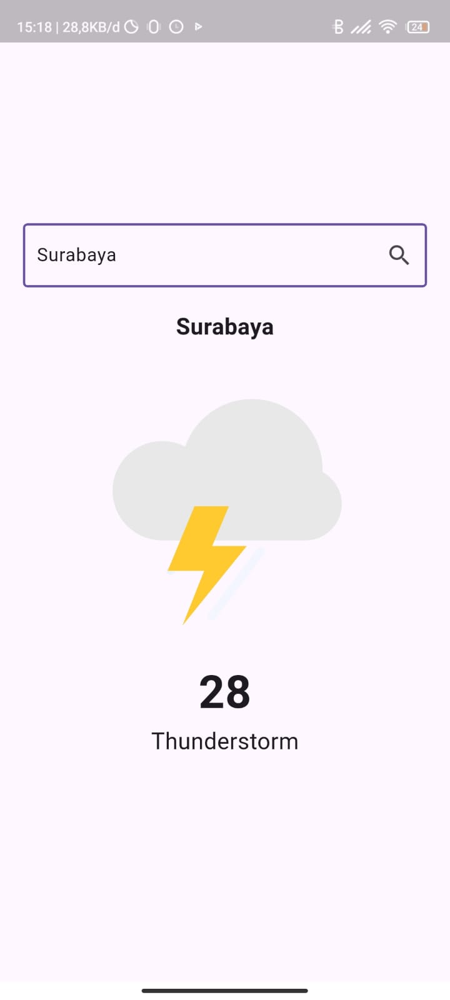

# 🌦️ Weather App

Weather App adalah aplikasi berbasis **Flutter** yang menampilkan informasi cuaca real-time berdasarkan lokasi pengguna. Aplikasi ini menggunakan **API cuaca** untuk mengambil data suhu, kelembaban, kecepatan angin, dan kondisi cuaca lainnya.

---

## 🚀 Fitur  
✅ Menampilkan cuaca berdasarkan lokasi pengguna  
✅ Pencarian cuaca berdasarkan kota tertentu  
✅ Informasi suhu
✅ UI responsif dan menarik  

---

## 🛠️ Teknologi yang Digunakan  
Project ini dibuat menggunakan:  
- 🏗️ **Flutter** (Dart)  
- 🌍 **OpenWeatherMap API** (atau API cuaca lainnya)  
- 🎨 **Geolocator** untuk mengambil lokasi  
- 🔗 **HTTP package** untuk mengambil data dari API  

---

## 📦 Instalasi  

1️⃣ Clone repositori ini:  
   git clone https://github.com/lintingggg/weather_app.git

2️⃣ Masuk ke folder proyek:
    cd weather-app

3️⃣ Install dependencies:
    flutter pub get

4️⃣ Jalankan aplikasi di emulator atau perangkat:
    flutter run

## 🔑 Konfigurasi API

Aplikasi ini menggunakan OpenWeatherMap API. Untuk menggunakannya, ikuti langkah berikut:
1. Daftar di OpenWeatherMap
2. Dapatkan API Key
3. Buat file .env (jika menggunakan flutter_dotenv) atau langsung edit di kode seperti ini:
    const String apiKey = "YOUR_API_KEY";

## 📌 Cara Penggunaan

1️⃣ Buka aplikasi, aplikasi akan menampilkan cuaca berdasarkan lokasi pengguna.
2️⃣ Gunakan fitur pencarian untuk melihat cuaca di kota lain.
3️⃣ Lihat detail cuaca.

## 📸 Screenshot

## 👤 Penulis

Muhammad Iqbal Faza – [GitHub](https://github.com/lintingggg) | [LinkedIn](https://linkedin.com/in/muhammad_iqbal_faza)

